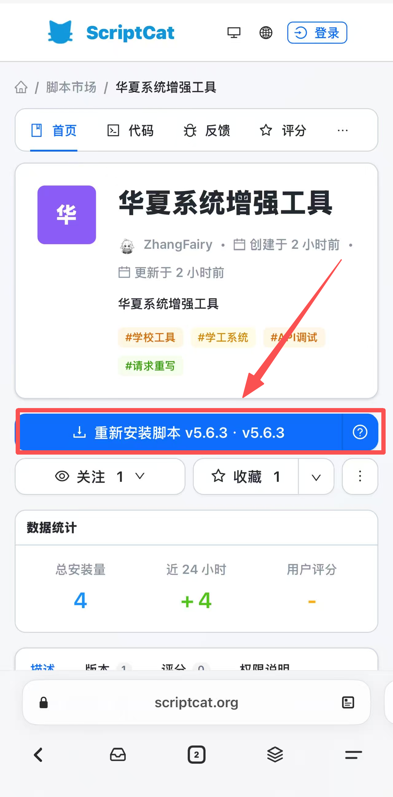
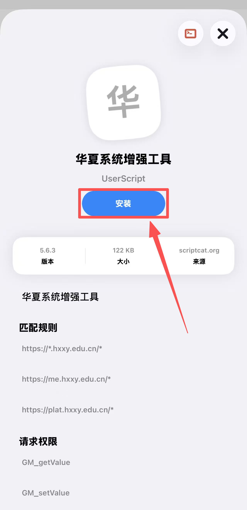
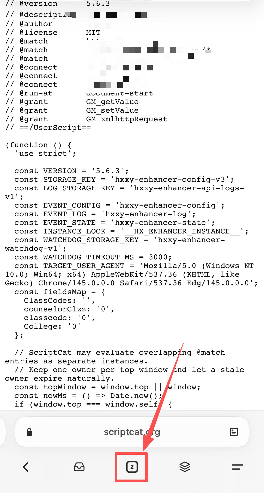
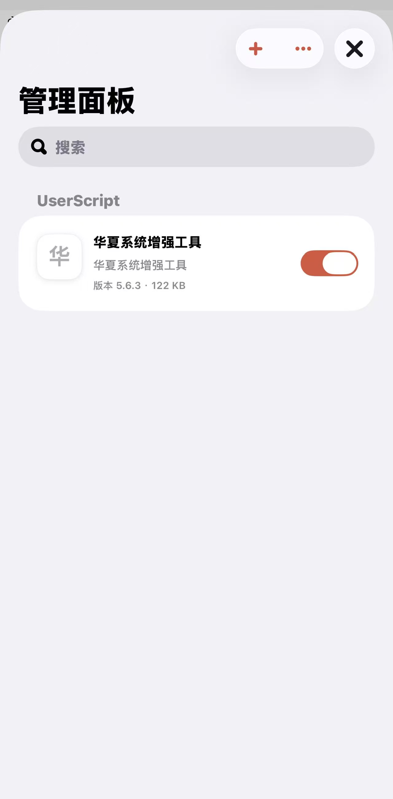
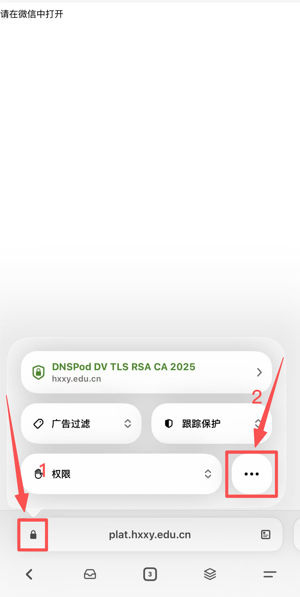
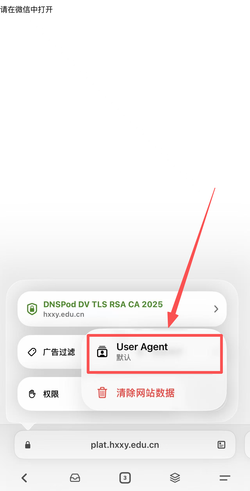
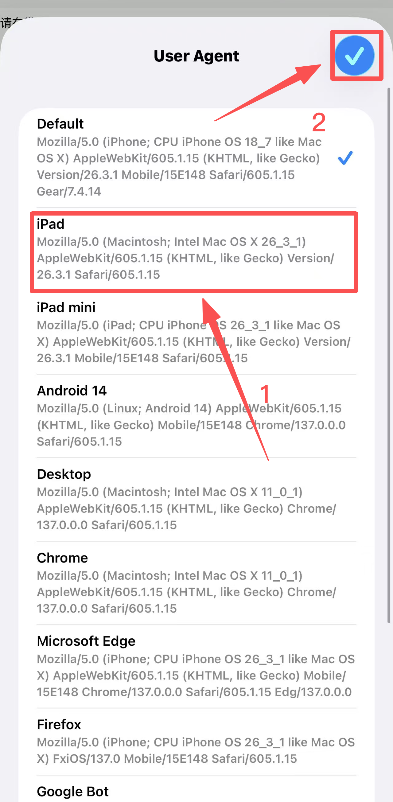
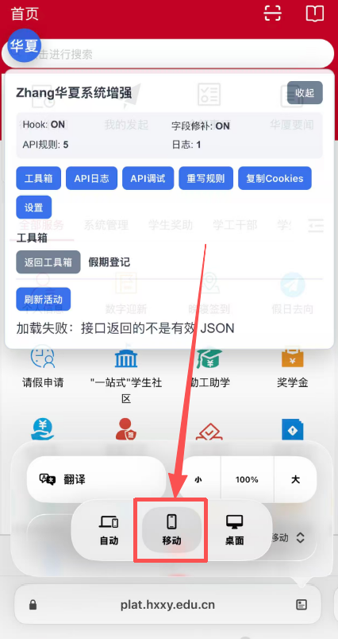

# 华夏系统增强工具

华夏系统增强工具是一款面向脚本猫、Tampermonkey 等用户脚本管理器的浏览器脚本，运行于华夏相关系统页面。脚本提供常用学工操作入口，并集成请求调试、重写规则和接口日志等高级工具。

## 下载

- **脚本猫**：https://scriptcat.org/zh-CN/script-show-page/7226
- **仓库**：[Github](https://github.com/FairyXH/HXXY_Script)

## 功能介绍

### 学工系统快捷工具

- **请假销假**：查询当前请假记录，并在脚本面板中执行销假。
- **学生活动**：查询活动列表和详情，查看报名状态、活动提醒，并提供报名、签到、签退等相关操作。
- **假期登记**：查询假期登记活动，执行离校、到达和返校确认。
- **晚寝签到**：查看晚寝考勤活动并执行签到相关操作。
- **移植接口目录**：内置学工系统常用接口，支持修改参数、发起请求及保存为自定义 API。
- **WebVPN 改名**：在 WebVPN 页面修改账号姓名和昵称。

### 页面与权限增强

- 自动修补部分页面字段，改善特定页面和嵌套页面的可用性。
- 内置规则可解除综测活动未开始、综测申请过期、Plat 应用访问、学生活动审核等前端限制。
- 综测活动列表默认加载全部学年活动。
- 可按需启用或关闭字段修补、API 规则、API 日志和页面 UA 锁定。
- 页面连续无响应时提供自动恢复机制。

### 调试与高级功能

- **API 调试**：支持 `GET`、`POST`、`PUT`、`DELETE` 请求，可编辑 URL、请求头和请求体，并保存常用 API。
- **API 日志**：记录页面中的 XHR 和 Fetch 请求，显示原始响应及修改后的响应；日志条目支持编辑、重放和保存。
- **请求重写**：支持替换请求、替换响应、修改请求、修改响应和请求重定向，可使用普通文本或正则表达式匹配 URL 与内容。
- **Cookie 复制**：复制当前页面中 JavaScript 可读取的 Cookie；`HttpOnly` Cookie 不可读取。
- **配置持久化**：脚本设置、自定义规则、已保存 API 和受数量限制的 API 日志会保存在用户脚本管理器中。

## 适用范围

- `https://me.hxxy.edu.cn/*`
- `https://plat.hxxy.edu.cn/*`
- `https://*.hxxy.edu.cn/*`

脚本需要用户先正常登录对应系统，并使用当前浏览器会话执行操作。涉及提交、签到、销假、审核等写操作时，请在发送前核对页面账号、接口参数和当前记录。

## 基本使用

1. 按下方教程安装脚本猫并导入 [`main.user.js`](./main.user.js)。
2. 登录[华夏学工系统](https://me.hxxy.edu.cn/)。
3. 页面右侧出现“华夏”悬浮按钮后，点击按钮打开增强工具面板。
4. 普通功能位于“工具箱”；请求日志、API 调试、重写规则和开关项可从面板顶部直接进入。

## 安装教程

脚本猫界面无法展示教程图片，请前往[Github](https://github.com/FairyXH/HXXY_Script)查看。

**华夏系统增强脚本使用教程(By Zhang)**

现版本已支持从脚本猫页面在线安装，在本文的“下载”部分点击前往脚本猫页面按引导安装即可。

电脑端Edge浏览器直接前往脚本猫页面按引导安装即可。

安卓/鸿蒙手机端、安卓/鸿蒙平板，可前往应用商店安装Edge浏览器(鸿蒙需要卓易通)，进入脚本猫链接页面按提示安装即可。

手机端如果遇到“请在微信中打开”，则需要更改为“查看桌面网站”模式，具体往下滑到“手机/平板教程”部分的使用说明。

iOS、iPadOS的Edge浏览器尚不兼容脚本猫，可以前往App Store下载“Gear 浏览器”。详情请看iOS、iPadOS教程。

**一、iOS、iPadOS教程**

该部分教程由 @随身玩伴小Q 提供iOS环境测试援助。该教程为在线下载教程，无本地导入方法，其他方案请自行探究。

由于iOS、iPadOS的Edge浏览器尚不兼容脚本猫，需要前往App Store下载“Gear 浏览器”。

第一步，前往App Store下载“Gear 浏览器”。

第二步，复制本文的“下载”部分脚本猫页面链接，在Gear 浏览器中打开，按提示安装脚本。
|  |  |
|----|----|

如果遇到全是代码的页面，直接关掉就行。
现在就安装完毕了。

|  |  |
|----|----|

第三步，前往[华夏学工系统](https://me.hxxy.edu.cn/)并完成登录，可能会提示“请在微信中打开”（iPadOS可直接使用，无需切换UA）。

解决方案：保持该页面不动，在搜索栏左侧点击锁形图标，从网站设置中更改用户代理，并切换桌面和移动内容模式。
|  |  |
|----|----|

选择iPad或其他桌面端UA

登录完毕之后，你可以再次切换回移动页面方便使用。

|  |  |
|----|----|

------------------------------------------------------------------------

以下教程是纯本地导入教程，无特殊需求不需要使用，请直接前往本文的“下载”部分点击前往脚本猫页面按引导在线安装即可。

**一、安卓/鸿蒙手机(平板)教程**

本章节教程适用于安卓/鸿蒙系统的手机、平板。

鸿蒙系统需要使用卓易通安装Edge浏览器，后续步骤与安卓一致。

**（一）保存脚本文件**

若你是从微信收到脚本文件的，先点击聊天记录中的脚本文件，然后点击右上角三个点，点击“保存”按钮将脚本文件保存到本地，并记住保存的位置。

|  |  |
|----|----|

**\**

**（二）浏览器插件的安装**

第一步、打开Edge浏览器，点击右下角的菜单，然后点击“扩展”

|  |  |
|----|----|

------------------------------------------------------------------------

第二步、找到“脚本猫”并点击获取，勾选允许并点击“添加”

|  |  |
|----|----|

------------------------------------------------------------------------

第三步、稍等片刻，脚本猫即安装完毕。

------------------------------------------------------------------------

**（三）脚本的导入**

第四步、再次打开“拓展”菜单，然后点击脚本猫。

|  |  |
|----|----|

------------------------------------------------------------------------

第五步、在弹出的界面中点击小齿轮图标，

进入插件页面后点击“跳过”

|  |  |
|----|----|

------------------------------------------------------------------------

第六步、点击“新建脚本”，选择“本地导入”。

找到你保存的脚本，点击它。

|  |  |
|----|----|

------------------------------------------------------------------------

第七步、点击“安装”按钮，脚本即导入完毕。

|  |  |
|----|----|

------------------------------------------------------------------------

**（四）使用说明**

现在你可以前往 学工系统(链接：https://me.hxxy.edu.cn) 使用脚本了。移动端特别注意：你可能需要在菜单里点击“查看桌面网站”才能访问，登录完毕之后，你可以再次点击菜单里的“手机网站”切换回手机页面方便使用。

|  |  |
|----|----|

**二、电脑教程**

以Windows操作系统为例，MacOS、Linux同理。

1.  保存脚本文件：把接收到的脚本文件保存到一个你找得到的位置。

2.  浏览器插件的安装

第一步、打开Microsoft Edge浏览器

------------------------------------------------------------------------

第二步、搜索“脚本猫”

或直接进入网址：https://scriptcat.org/zh-CN

------------------------------------------------------------------------

第三步、点击“添加到Edge浏览器”按钮，

或直接进入插件网址：https://microsoftedge.microsoft.com/addons/detail/%E8%84%9A%E6%9C%AC%E7%8C%AB/liilgpjgabokdklappibcjfablkpcekh

------------------------------------------------------------------------

第四步、点击“获取”按钮。

稍等片刻，在弹出窗中点击“添加扩展”

------------------------------------------------------------------------

第五步、在菜单中点击“扩展”，然后点击“管理扩展”

------------------------------------------------------------------------

第六步、点击脚本猫下方的“详细信息”

勾选“允许用户脚本”

------------------------------------------------------------------------

第七步、点击右上角的拼图图标，点击“脚本猫”

然后点击小齿轮图标

|  |  |
|----|----|

------------------------------------------------------------------------

第八步、点击右上角的“新建脚本”，选择“本地导入”

找到你的脚本文件打开

------------------------------------------------------------------------

第九步、点击“安装”按钮，脚本即导入成功

|  |  |
|----|----|

------------------------------------------------------------------------

现在你可以前往 学工系统(链接：https://me.hxxy.edu.cn) 使用脚本了。

## 鸣谢

感谢以下人员对项目的支持：

- iOS 端兼容性测试：@随身玩伴小Q